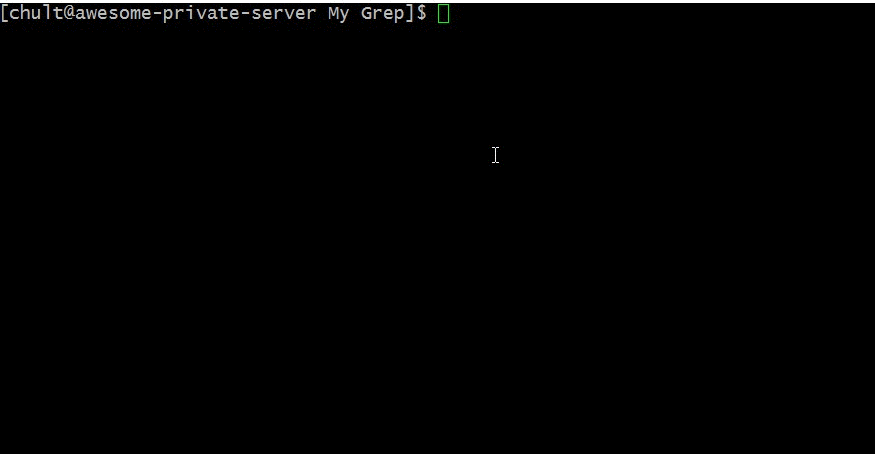

# MyGrep
An implementation of the GREP program used in UNIX systems. My GREP imploys multithreading to allow searching over a number of files or directories to improve performance. However, the core searching algorithm of My GREP is a naive approach unlike the original GREP program which employs complex regular expression to search for its targeted string.

Usage:  
Build the file using the provided makefile  
Run the binary file passing in the target search pattern and file/directory | example: search printf ./file.cpp  

